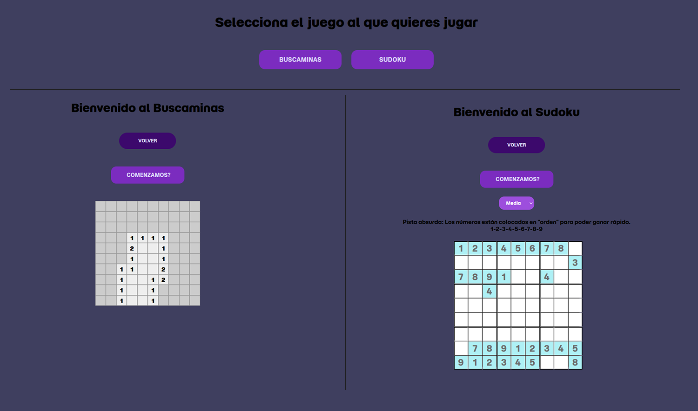

<h1 align="center" style="color: #0366d6;">
   JAVASCRIPT-JUEGOS
</h1>

Repositorio de lógica de videojuegos en JAVASCRIPT

## Descripción 📝

Proyecto realizado con HTML, CSS, SASS y JAVASCRIPT para practicar la lógica en la creación de videojuegos.

## Vista previa en vivo 👀
Puedes ver los ejercicios funcionando aquí:  
🔗 [https://github.com/Oconcejero/JAVASCRIPT-JUEGOS/](https://oconcejero.github.io/JAVASCRIPT-JUEGOS/)

Puedes ver una vista previa en vivo del encabezado 
